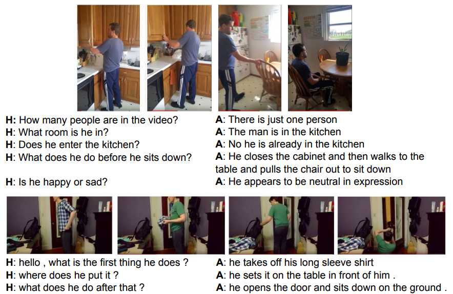
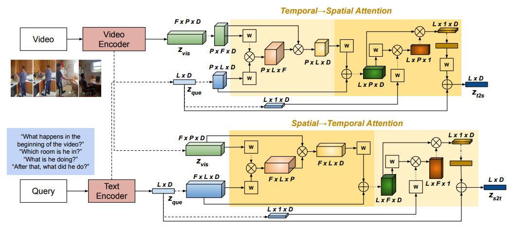
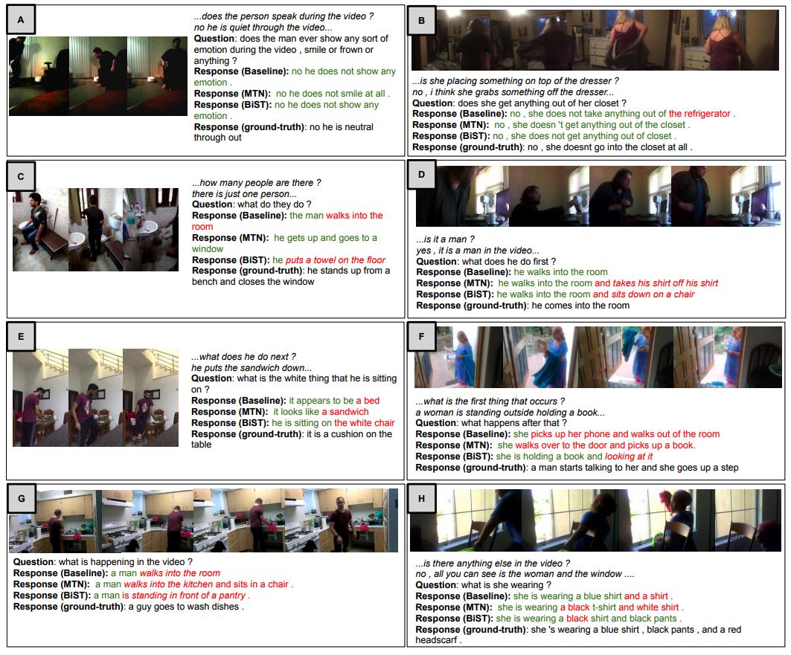

## BiST: Bi-directional Spatio-Temporal Reasoning for Video-Grounded Dialogues
 

This is the PyTorch implementation of the paper:
**[BiST: Bi-directional Spatio-Temporal Reasoning for Video-Grounded Dialogues](<https://www.aclweb.org/anthology/2020.emnlp-main.145/>)**. [**Hung Le**](https://github.com/henryhungle), [Doyen Sahoo](https://scholar.google.com.sg/citations?user=A61jJD4AAAAJ&hl=en), [Nancy F. Chen](https://sites.google.com/site/nancyfchen/home), [Steven C.H. Hoi](https://sites.google.com/view/stevenhoi/). ***[EMNLP 2020](<https://www.aclweb.org/anthology/2020.emnlp-main.145/>)***. ([arXiv](https://arxiv.org/abs/2010.10095)) 

This code has been written using PyTorch 1.0.1. If you find the paper or the source code useful to your projects, please cite the following bibtex: 
<pre>
@inproceedings{le-etal-2020-bist,
    title = "{B}i{ST}: Bi-directional Spatio-Temporal Reasoning for Video-Grounded Dialogues",
    author = "Le, Hung  and
      Sahoo, Doyen  and
      Chen, Nancy  and
      Hoi, Steven C.H.",
    booktitle = "Proceedings of the 2020 Conference on Empirical Methods in Natural Language Processing (EMNLP)",
    month = nov,
    year = "2020",
    address = "Online",
    publisher = "Association for Computational Linguistics",
    url = "https://www.aclweb.org/anthology/2020.emnlp-main.145",
    doi = "10.18653/v1/2020.emnlp-main.145",
    pages = "1846--1859"
}
</pre>

## Abstract
Video-grounded dialogues are very challenging due to (i) the complexity of videos which contain both spatial and temporal variations, and (ii) the complexity of user utterances which query different segments and/or different objects in videos over multiple dialogue turns. However, existing approaches to video-grounded dialogues often focus on superficial temporal-level visual cues, but neglect more fine-grained spatial signals from videos. To address this drawback, we proposed Bi-directional Spatio-Temporal Learning (BiST), a vision-language neural framework for high-resolution queries in videos based on textual cues. Specifically, our approach not only exploits both spatial and temporal-level information, but also learns dynamic information diffusion between the two feature spaces through spatial-to-temporal and temporal-to-spatial reasoning. The bidirectional strategy aims to tackle the evolving semantics of user queries in the dialogue setting. The retrieved visual cues are used as contextual information to construct relevant responses to the users. Our empirical results and comprehensive qualitative analysis show that BiST achieves competitive performance and generates reasonable responses on a large-scale AVSD benchmark. We also adapt our BiST models to the Video QA setting, and substantially outperform prior approaches on the TGIF-QA benchmark.

  
Examples of video-grounded dialogues from the benchmark datasets of Audio-Visual Scene Aware Dialogues (AVSD) challenge. H: human, A: the dialogue agent.

## Model Architecture

 
Our bidirectional approach models the dependencies between text and vision in two reasoning directions: spatial→temporal and temporal→spatial. ⊗ and ⊕ denote dot-product operation and element-wise summation.

## Dataset

We use the AVSD@DSTC7 benchmark. Download the data [here](https://github.com/hudaAlamri/DSTC7-Audio-Visual-Scene-Aware-Dialog-AVSD-Challenge) and unzip into your local directory. 

To use the spatio-temporal features, we extracted the visual features from a [published](https://github.com/kenshohara/video-classification-3d-cnn-pytorch) pretrained ResNext-101 model. The extraction code is slightly changed to obtain the features right before average pooling along spatial regions. This extracted visual features for all videos used in the AVSD benchmark can be downloaded here (TBD). 

For audio features, we reused the public features accompanying the AVSD benchmark (Please refer to the benchmark [repo](https://github.com/hudaAlamri/DSTC7-Audio-Visual-Scene-Aware-Dialog-AVSD-Challenge)). 

## Scripts 

We created `scripts/exec.sh` to prepare evaluation code, train models, generate dialogue response, and evaluating the generated responses with automatic metrics. You can directly run this file which includes example parameter setting: 

| Parameter           | Description                                                  | Values                                                       |
| :------------------ | :----------------------------------------------------------- | ------------------------------------------------------------ |
| **device** | device to specific which GPU to be used | e.g. 0, 1, 2, ...
| **stage**  | different value specifying different processes to be run  | 1: training stage, 2. generating stage, 3: evaluating stage |
| **test_mode** | test mode is on for debugging purpose. Set true to run with a small subset of data | true/false |
| **t2s**  | set 1 to use temporal-to-spatial attention operation                                  | 0, 1                                                  |
| **s2t** | set 1 to use spatial-to-temporal attention operation                                | 0, 1                                                      |
| **nb_workers**      | number of worker to preprocess data and create batches                                    | e.g. 4  |

An example to run `scripts/exec.sh` is shown in  `scripts/run.sh`.

Other model parameters can be also be set, either manually or changed as dynamic input, including but not limited to:

| Parameter           | Description                                                  | Values                                                       |
| :------------------ | :----------------------------------------------------------- | ------------------------------------------------------------ |
| **data_root** | the directory of dialogue data as well as video visual/audio extracted features | `data/dstc7/`
| **include_caption**  | specify the type of caption to be used, 'none' if not using caption as input  | `caption`, `summary`, or `none` |
| **d_model** | dimension of word embedding as well as transformer layer dimension | e |.g. 128
| **nb_blocks**  | number of response decoding attention layers | e.g. 3                                           |
| **nb_venc_blocks** | number of visual reasoning attention layers                               | e.g. 3                                                     |
| **nb_cenc_blocks**      | number of caption reasoning attention layers                                    | e.g. 3  |
| **nb_aenc_blocks**      | number of audio reasoning attention layers                                    | e.g. 3  |

Refer to `configs` folder for more definitions of other parameters which can be set through  `scripts/exec.sh`. 

While training, the model with the best validation is saved. The model is evaluated by using the losses from response generation as well as question auto-encoding generation. 
The model output, parameters, vocabulary, and training and validation logs will be save into folder determined in the `expdir` parameter.  

Examples of pretrained BiST models using different parameter settings through `scripts/run.sh` can be downloaded below. Unzip the download file and update the `expdir` parameter in the test command in the `scripts/test.sh` to the corresponding unzip directory. Using the pretrained model, the test script provides the following results:

| Model              | Epochs | Link     | Visual  | Audio  | Cap | BLEU1 | BLEU2 | BLEU3 | BLEU4 | METEOR | ROUGE-L | CIDEr |
|--------------------|--------|----------|---------|--------|-----|-------|-------|-------|-------|--------|---------|-------|
| visual-only        | 50     | Download | ResNeXt | No     | No  | 0.711 | 0.578 | 0.475 | 0.394 | 0.261  | 0.550   | 1.050 |
| visual-audio-text  | 50     | Download | ResNeXt | VGGish | Yes | 0.752 | 0.619 | 0.510 | 0.423 | 0.283  | 0.581   | 1.192 |
| visual-text        | 30     | Download | ResNeXt | No     | Yes | 0.754 | 0.622 | 0.515 | 0.430 | 0.284  | 0.584   | 1.190 |
| visual-text        | 50     | Download | ResNeXt | No     | Yes | 0.756 | 0.621 | 0.513 | 0.428 | 0.285  | 0.585   | 1.205 |

## Sample Generated Dialogue Responses

 
Comparison of dialogue response outputs of BiST against the baseline models: Baseline (Hori et al., 2019) and MTN (Le et al., 2019b). Parts of the outputs that match and do not match the ground truth are highlighted in green and red respectively.

